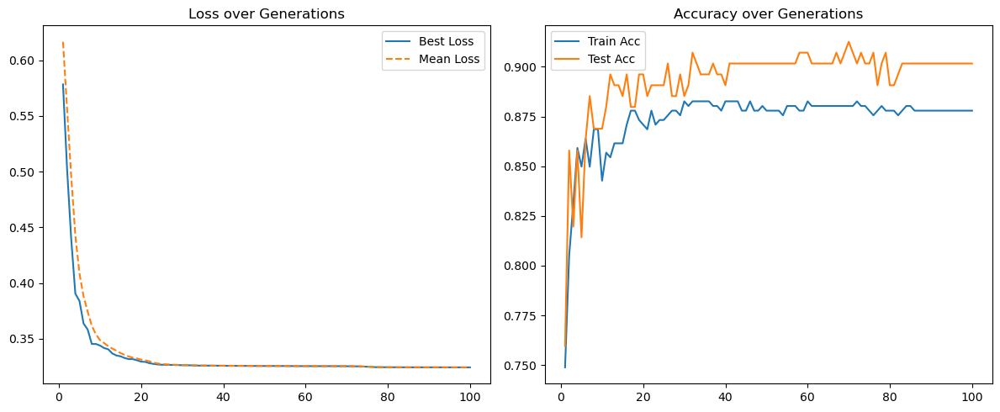
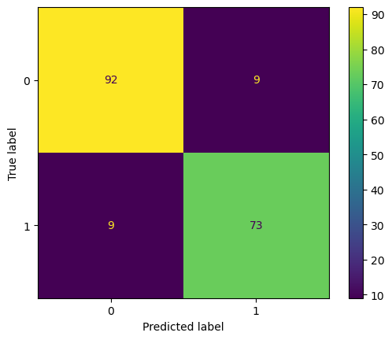
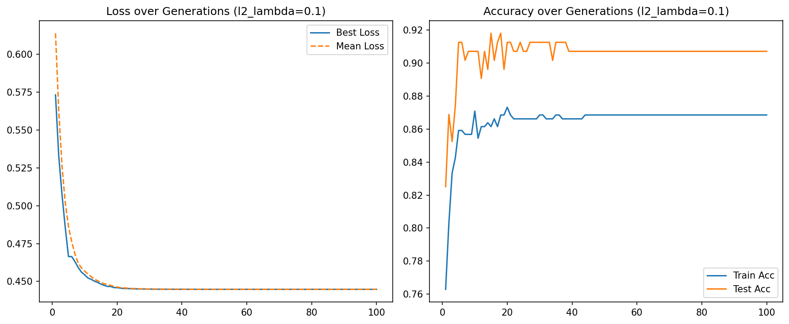
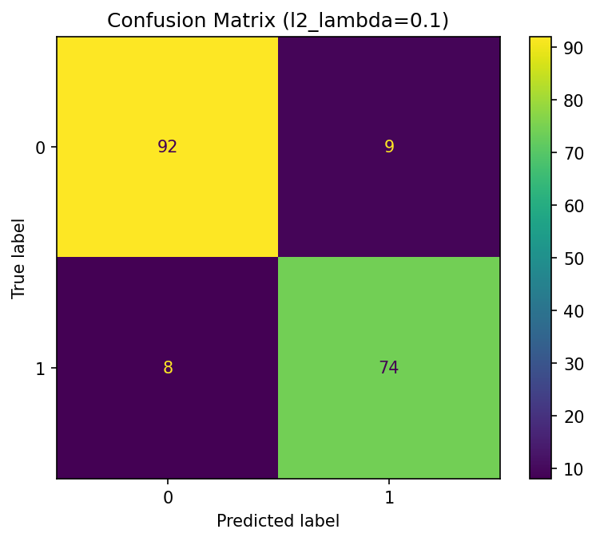

# Evolution Strategy for Logistic Regression

## Overview

This project implements a self-adaptive Evolution Strategy (ES) to optimize a binary Logistic Regression classifier for heart disease prediction.

Instead of using conventional gradient-based optimization methods, the parameters of the Logistic Regression model are evolved through a population-based evolutionary process.

The project combines concepts from Evolutionary Computation and Machine Learning, including:

- Logistic Regression
- Evolution Strategies
- Self-Adaptive Mutation
- `(μ + λ)` Selection
- Binary Classification
- Cross-Entropy Optimization
- L2 Regularization
- Population-Based Search
- Model Evaluation

The complete optimization process is implemented in Python and NumPy.

---

# Project Objectives

The main objectives of this project are:

- Implement binary Logistic Regression manually
- Optimize model parameters without gradient descent
- Implement a self-adaptive Evolution Strategy
- Evolve both model parameters and mutation step sizes
- Apply `(μ + λ)` elitist selection
- Analyze evolutionary convergence
- Evaluate classification performance
- Investigate the effect of L2 regularization
- Compare different ES population configurations

---

# Dataset

The project uses a Heart Disease dataset for binary classification.

The included dataset contains:

```text
609 samples
14 original columns
```

The target variable is originally stored in:

```text
num
```

with values:

```text
0, 1, 2, 3, 4
```

For binary classification, the target is transformed according to:

```text
num = 0     -> No heart disease

num > 0     -> Heart disease present
```

The resulting binary target is:

```python
target = 1 if num > 0 else 0
```

---

# Class Distribution

After converting the original target into a binary label, the dataset contains:

| Class | Meaning | Samples |
| --- | --- | ---: |
| 0 | No heart disease | 335 |
| 1 | Heart disease present | 274 |

The dataset is therefore relatively balanced compared with many medical classification datasets.

---

# Input Features

The dataset contains clinical variables related to cardiovascular health.

The features used for classification include variables such as:

- Age
- Sex
- Chest pain type
- Resting blood pressure
- Cholesterol
- Fasting blood sugar
- Resting ECG
- Maximum heart rate
- Exercise-induced angina
- ST depression
- Slope
- Thalassemia-related information

The `dataset` column is treated as metadata and removed before model training.

The original `num` column is also removed after constructing the binary target.

---

# Data Preprocessing

The preprocessing pipeline consists of:

1. Loading the dataset
2. Converting the original target to binary labels
3. Removing unnecessary columns
4. Performing a stratified train-test split
5. Calculating normalization statistics from the training data
6. Applying z-score normalization
7. Preparing NumPy arrays for Evolution Strategy optimization

---

# Train-Test Split

The dataset is divided into:

```text
Training: 70%
Testing:  30%
```

A stratified split is used to preserve the class distribution.

The random state is fixed to:

```text
42
```

for reproducibility.

---

# Feature Standardization

The input features are standardized using z-score normalization:

```text
x_standardized = (x - μ) / σ
```

where:

```text
μ = training-set mean
σ = training-set standard deviation
```

Importantly, the mean and standard deviation are calculated using only the training data.

The same statistics are then applied to the test set.

This prevents information leakage from the test data into the training process.

---

# Logistic Regression Model

The binary classifier is based on Logistic Regression.

For an input vector `x`, the model computes:

```text
z = W^T x + b
```

The output probability is obtained using the sigmoid function:

```text
sigmoid(z) = 1 / (1 + exp(-z))
```

Therefore:

```text
y_hat = sigmoid(W^T x + b)
```

where:

- `W` represents the model weights
- `b` represents the bias
- `y_hat` represents the estimated probability of heart disease

---

# Model Parameters

The complete Logistic Regression parameter vector is represented as:

```text
θ = [W, b]
```

Instead of updating these parameters using gradients, the Evolution Strategy treats them as an individual in an evolutionary population.

The optimization problem therefore becomes:

```text
Find θ that minimizes classification loss
```

---

# Cross-Entropy Loss

Binary Cross-Entropy is used as the primary objective function.

The loss is:

```text
L =
-[y log(y_hat) + (1-y) log(1-y_hat)]
```

The average loss over the training dataset is used to evaluate each individual.

Predicted probabilities are clipped before calculating logarithms to improve numerical stability.

---

# L2 Regularization

Optional L2 regularization is added to the loss:

```text
L_total =
L_cross_entropy + λ_reg ||W||²
```

The regularization term is applied only to the weight parameters and not to the bias.

The baseline experiment uses:

```text
λ_reg = 0.01
```

An additional experiment evaluates stronger regularization using:

```text
λ_reg = 0.1
```

---

# Evolution Strategy

Evolution Strategies are population-based optimization algorithms designed primarily for continuous parameter optimization.

Unlike gradient-based optimization, Evolution Strategies do not require derivatives of the objective function.

Instead, candidate parameter vectors are repeatedly:

```text
Generated
Evaluated
Mutated
Selected
```

until the population converges toward stronger solutions.

---

# Individual Representation

Each individual contains two main components:

```text
θ = Model parameters

σ = Mutation step sizes
```

Therefore, every individual contains both:

1. A candidate Logistic Regression model
2. Parameters controlling how strongly that model mutates

This enables self-adaptive evolutionary optimization.

---

# Parameter Initialization

The Logistic Regression parameters are initialized uniformly:

```text
θ ~ Uniform(-0.1, 0.1)
```

The mutation step sizes are initialized using:

```text
σ ~ Uniform(0.01, 0.1)
```

Each model parameter has its own mutation step size.

---

# Self-Adaptive Mutation

A major feature of the implementation is self-adaptation.

Instead of using a fixed mutation strength throughout training, the Evolution Strategy evolves the mutation step sizes together with the model parameters.

The step sizes are updated using log-normal mutation.

Conceptually:

```text
σ_i' =
σ_i * exp(
    τ' * N(0,1)
    +
    τ * N_i(0,1)
)
```

The model parameters are then mutated according to:

```text
θ_i' =
θ_i + σ_i' * N_i(0,1)
```

This allows the algorithm to automatically adjust the scale of exploration during optimization.

---

# Global and Local Learning Rates

The self-adaptive mutation uses both global and local learning rates.

These rates depend on the number of optimized parameters.

The global component changes all mutation strengths together, while the local component allows individual parameters to adapt independently.

This combination provides a balance between:

- Global exploration
- Parameter-specific adaptation

---

# Mutation Constraints

To improve numerical stability, several constraints are applied.

Model parameters are clipped to:

```text
[-5, 5]
```

Mutation step sizes are prevented from becoming smaller than:

```text
1e-6
```

These constraints prevent extreme parameter values and mutation collapse.

---

# Fitness Function

Evolution Strategies traditionally maximize fitness.

Since the objective of Logistic Regression training is to minimize loss, fitness is defined as:

```text
fitness = -loss
```

Therefore:

```text
Lower loss
    ↓
Higher fitness
    ↓
Greater probability of survival
```

---

# (μ + λ) Evolution Strategy

The project uses an elitist:

```text
(μ + λ)
```

Evolution Strategy.

In this notation:

```text
μ = Number of parent individuals

λ = Number of offspring
```

At every generation:

1. The current population contains `μ` parents
2. `λ` offspring are generated
3. Parents and offspring are combined
4. All individuals are evaluated
5. The best `μ` individuals survive

Therefore, strong solutions can survive across multiple generations.

---

# Evolutionary Training Process

The overall training procedure is:

```text
1. Initialize μ individuals

2. Evaluate their fitness

3. Generate λ offspring

4. Apply self-adaptive mutation

5. Evaluate offspring fitness

6. Combine parents and offspring

7. Sort according to fitness

8. Keep the best μ individuals

9. Record training statistics

10. Repeat for the configured number of generations
```

---

# Default ES Configuration

The main implementation uses the following default configuration:

| Hyperparameter | Value |
| --- | ---: |
| μ | 30 |
| λ | 210 |
| Generations | 100 |
| L2 Regularization | 0.01 |

The notebook also investigates alternative configurations such as:

```text
μ = 50, λ = 250
```

and:

```text
μ = 30, λ = 400
```

A stronger regularization experiment additionally uses:

```text
μ = 30
λ = 400
λ_reg = 0.1
```

---

# Convergence Analysis

During training, several statistics are recorded for every generation:

- Best training loss
- Mean training loss
- Training accuracy
- Test accuracy

These measurements provide insight into both evolutionary convergence and generalization.

---

# Baseline Training Results

The main experiment uses:

```text
μ = 30
λ = 210
Generations = 100
L2 = 0.01
```

The training loss decreases rapidly during the early generations.

The reported best loss reaches approximately:

```text
0.3438
```

by generation 10.

At the end of training, the best loss reaches approximately:

```text
0.3242
```

The population then remains relatively stable.

---

# Training and Test Accuracy

During the saved baseline experiment, training accuracy increased from approximately:

```text
0.75
```

to:

```text
0.8779
```

Test accuracy stabilized around:

```text
0.90
```

The relatively small difference between training and test performance indicates that the model did not show severe overfitting in the recorded experiment.

---

# Baseline Test Performance

The final baseline model achieved:

| Metric | Score |
| --- | ---: |
| Accuracy | 0.9016 |
| Precision | 0.8902 |
| Recall | 0.8902 |
| F1-Score | 0.8902 |

These results demonstrate that an Evolution Strategy can successfully optimize a Logistic Regression classifier without using gradient information.

---

# Baseline Confusion Matrix

The saved baseline confusion matrix contains:

```text
True Negatives  = 92
False Positives = 9
False Negatives = 9
True Positives  = 73
```

or:

```text
[[92, 9],
 [ 9, 73]]
```

The model therefore makes an equal number of false-positive and false-negative predictions in the baseline experiment.

---

# Baseline Training Curves



The plot visualizes:

- Best population loss
- Mean population loss
- Training accuracy
- Test accuracy

The curves demonstrate rapid early improvement followed by stable convergence.

---

# Baseline Confusion Matrix Visualization



The confusion matrix provides a direct visualization of correct and incorrect predictions for both classes.

---

# Stronger L2 Regularization

A second experiment increases the regularization coefficient to:

```text
λ_reg = 0.1
```

while using a larger offspring population.

The configuration is:

```text
μ = 30
λ = 400
λ_reg = 0.1
```

The objective is to investigate whether stronger regularization improves generalization.

---

# Stronger L2 Confusion Matrix

The saved confusion matrix for the stronger L2 experiment contains:

```text
True Negatives  = 92
False Positives = 9
False Negatives = 8
True Positives  = 74
```

or:

```text
[[92, 9],
 [ 8, 74]]
```

Compared with the baseline experiment, this configuration correctly identifies one additional positive case.

---

# Stronger L2 Training Curves



The plot shows the evolutionary behavior under stronger regularization.

---

# Stronger L2 Confusion Matrix Visualization



This experiment provides a useful comparison of how regularization affects the evolved Logistic Regression model.

---

# Sensitivity Analysis

The project also considers the sensitivity of the Evolution Strategy to several important hyperparameters.

---

## Population Size

Population size directly affects the balance between:

```text
Exploration
Computational Cost
```

A larger offspring population can increase diversity and explore a larger region of the search space.

However, it also increases the number of fitness evaluations required during each generation.

Smaller populations reduce computational cost but may increase the risk of premature convergence.

---

## Self-Adaptation Rates

The global and local mutation learning rates control how quickly mutation step sizes change.

Aggressive adaptation may improve early exploration but can also introduce instability.

Very slow adaptation may prevent the algorithm from adjusting efficiently to different stages of the search.

The theoretically motivated self-adaptive formulation used in this project provides a compromise between these behaviors.

---

## Regularization Strength

The L2 coefficient controls the penalty applied to large Logistic Regression weights.

Smaller values allow the model to fit the training data more freely.

Larger values encourage smaller parameter magnitudes and simpler models.

However, excessive regularization may cause underfitting.

The experiments compare:

```text
λ_reg = 0.01
```

and:

```text
λ_reg = 0.1
```

to investigate this trade-off.

---

# Medical Classification Considerations

For medical classification problems, overall accuracy alone is not sufficient.

False negatives are especially important because they correspond to patients with heart disease being classified as healthy.

The project therefore evaluates:

- Precision
- Recall
- F1-score
- Confusion matrix

in addition to accuracy.

The baseline model produced:

```text
9 false negatives
```

while the stronger L2 experiment produced:

```text
8 false negatives
```

This highlights the importance of examining class-specific errors when evaluating medical prediction models.

---

# Why Use Evolution Strategies?

Gradient-based optimization is the standard approach for Logistic Regression.

However, Evolution Strategies provide a useful alternative for studying optimization without derivative information.

Advantages include:

- No gradient calculation
- Applicability to non-differentiable objectives
- Population-based exploration
- Self-adaptive mutation
- Flexible objective functions

The project demonstrates that evolutionary optimization can successfully train a conventional machine learning classifier.

---

# Limitations

Several limitations should be considered.

## Computational Cost

Evolution Strategies require evaluating many candidate models.

For example, with:

```text
μ = 30
λ = 210
Generations = 100
```

a large number of fitness evaluations are required compared with standard gradient-based Logistic Regression.

---

## Single Train-Test Split

The reported performance is based on a fixed stratified train-test split.

Using cross-validation or repeated experiments would provide a more reliable estimate of generalization performance.

---

## Dataset Size

The included dataset contains only:

```text
609 samples
```

Therefore, the reported results should not be interpreted as clinical evidence.

The project is an educational machine learning experiment rather than a medical diagnostic system.

---

## Limited Hyperparameter Search

The project investigates several ES configurations but does not perform an exhaustive hyperparameter optimization.

A broader search over population sizes, mutation parameters, generation counts, and regularization coefficients could provide additional insights.

---

# Possible Improvements

Future extensions could include:

- K-fold cross-validation
- Repeated experiments with multiple random seeds
- ROC curve analysis
- ROC-AUC evaluation
- Precision-Recall curves
- Cost-sensitive fitness functions
- Class-weighted objectives
- Alternative Evolution Strategy configurations
- `(μ, λ)` selection
- Covariance Matrix Adaptation Evolution Strategy (CMA-ES)
- Hybrid evolutionary-gradient optimization
- Comparison with standard Gradient Descent
- Comparison with scikit-learn Logistic Regression
- Automated hyperparameter tuning

---

# Project Structure

```text
evolution-strategy-logistic-regression/
|
|-- main.ipynb
|-- Heart Disease dataset.csv
|
|-- accuracy_plot.png
|-- confusion_matrix.png
|-- accuracy_plot_l2_0_1.png
|-- confusion_matrix_l2_0_1.png
|
|-- requirements.txt
`-- README.md
```

---

# File Description

| File | Description |
| --- | --- |
| `main.ipynb` | Complete preprocessing, Logistic Regression, Evolution Strategy training, evaluation, and visualization |
| `Heart Disease dataset.csv` | Heart Disease dataset used in the experiments |
| `accuracy_plot.png` | Baseline evolutionary loss and accuracy curves |
| `confusion_matrix.png` | Baseline test-set confusion matrix |
| `accuracy_plot_l2_0_1.png` | Training curves using stronger L2 regularization |
| `confusion_matrix_l2_0_1.png` | Confusion matrix using stronger L2 regularization |
| `requirements.txt` | Python dependencies |
| `README.md` | Project documentation |

---

# Requirements

The project requires:

```text
numpy
pandas
matplotlib
scikit-learn
jupyter
```

Install the dependencies using:

```bash
pip install -r requirements.txt
```

---

# Running the Project

Clone or download the repository and install the required dependencies.

Then start Jupyter Notebook:

```bash
jupyter notebook
```

Open:

```text
main.ipynb
```

and run the notebook cells sequentially.

The dataset should remain in the same directory as the notebook:

```text
Heart Disease dataset.csv
```

---

# Technologies and Methods

- Python
- Jupyter Notebook
- NumPy
- Pandas
- Matplotlib
- scikit-learn
- Logistic Regression
- Evolution Strategies
- Evolutionary Computation
- Self-Adaptive Mutation
- `(μ + λ)` Selection
- Cross-Entropy Loss
- L2 Regularization
- Binary Classification
- Feature Standardization
- Population-Based Optimization
- Confusion Matrix Analysis

---

# Key Concepts Demonstrated

This project demonstrates:

- Evolutionary optimization
- Continuous parameter optimization
- Self-adaptation
- Strategy parameters
- Population initialization
- Mutation
- Elitist selection
- Logistic Regression
- Sigmoid classification
- Cross-Entropy optimization
- Regularization
- Binary classification
- Feature normalization
- Train-test splitting
- Classification metrics
- Convergence analysis
- Hyperparameter sensitivity
- Evolutionary Machine Learning

---

# Main Results

The baseline Evolution Strategy achieved:

```text
Accuracy  = 0.9016
Precision = 0.8902
Recall    = 0.8902
F1-Score  = 0.8902
```

with the confusion matrix:

```text
[[92, 9],
 [ 9, 73]]
```

The stronger L2 experiment produced:

```text
[[92, 9],
 [ 8, 74]]
```

showing a small improvement in positive-class detection in the saved experiment.

Overall, the results demonstrate that a self-adaptive Evolution Strategy can effectively optimize the parameters of a Logistic Regression classifier without gradient-based training.

---

# Conclusion

This project demonstrates the use of self-adaptive Evolution Strategies for continuous machine learning optimization.

Instead of training Logistic Regression using gradients, the model parameters and their mutation step sizes are evolved simultaneously through a `(μ + λ)` population-based process.

The experiments show stable convergence and strong binary classification performance on the Heart Disease dataset. The baseline model achieved approximately 90.16% test accuracy with balanced precision and recall.

The comparison with stronger L2 regularization also demonstrates how evolutionary optimization can be combined with conventional regularization techniques.

Overall, the project provides practical experience with Evolution Strategies, self-adaptive mutation, population-based optimization, Logistic Regression, regularization, and classification performance analysis.

---

# Course Information

**Course:** Evolutionary Computation  
**University:** Shiraz University   
**Year:** 2026

---

# Author

Saghar Kheradmand
